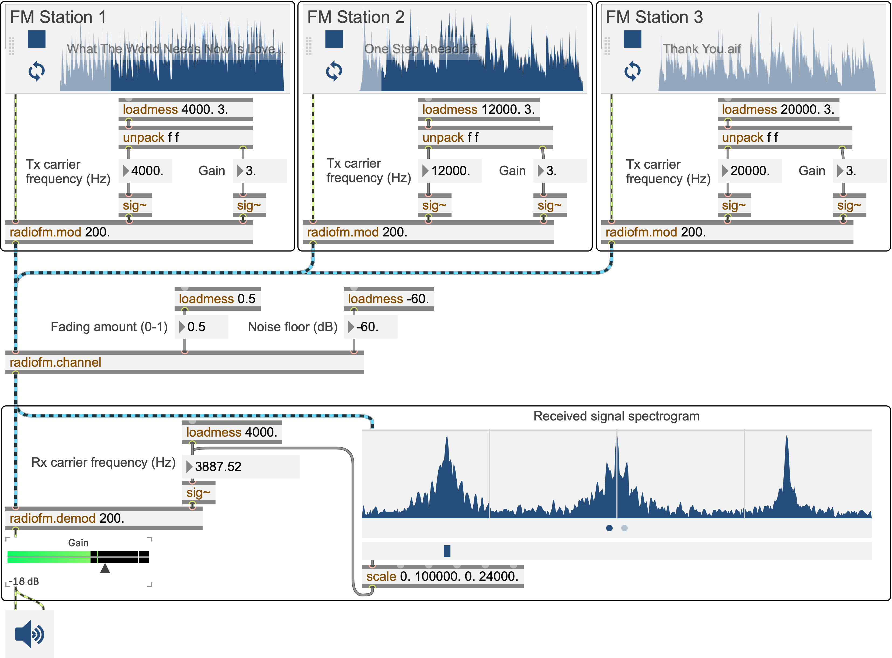

# FM Radio Simulator in Max/MSP

This is a set of abstractions in Max/MSP, called `radiofm`, for simulating FM modulation and demodulation at audio DSP rate in Max/MSP.

The repository contains:
- `radiofm.mod`: The FM modulator abstraction generates the modulated signals. This abstraction has frequency deviation k_f as first argument and allows signal inputs for audio signal, carrier frequency, and input gain.
- `radiofm.channel`: The channel abstraction that combines the modulated signals and adds noise and fading effects. This abstraction accepts inputs for amount of fading and noise floor level.
- `radiofm.demod`: The FM demodulator abstraction recovers the signal at a given carrier frequency and plays it back as an audio signal.
- `radiofm-example`: An example patch that demonstrates how the modules can be interconnected to simulate a complete FM radio transmission system.

