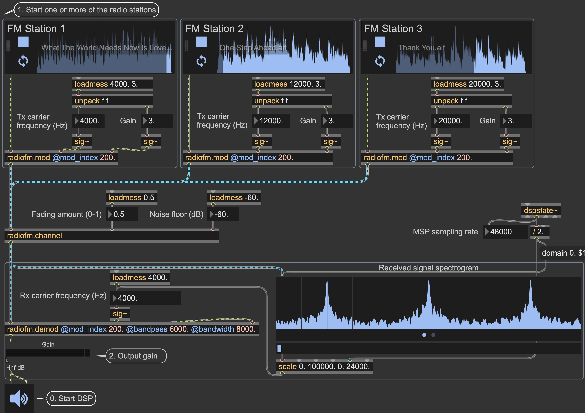

# FM Radio Simulator in Max/MSP

**radiofm** is a set of abstractions for simulating FM modulation and demodulation at audio DSP rate in Max/MSP

The repository contains:
- radiofm.mod: Modulator abstraction that generates a FM modulated signal from an audio input.
- radiofm.channel: Channel abstraction that adds noise and fading effects.
- radiofm.demod: Demodulator abstraction that FM demodulates a signal at a given carrier frequency and plays back the recovered audio signal.
- radiofm-examples: Help patch that demonstrates how the radiofm abstractions can be interconnected to simulate a complete FM radio transmission system.

This work was presented as a paper at [PdMaxCon25~](https://music.illinois.edu/pd-max-con/)

